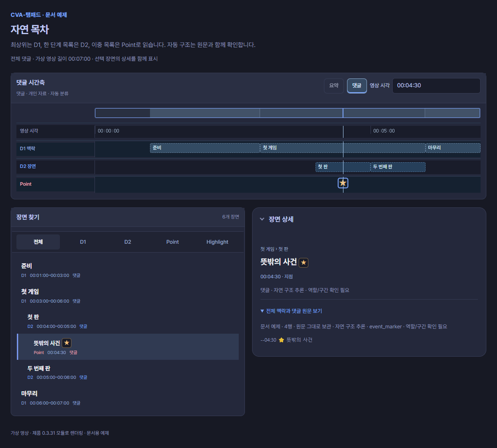
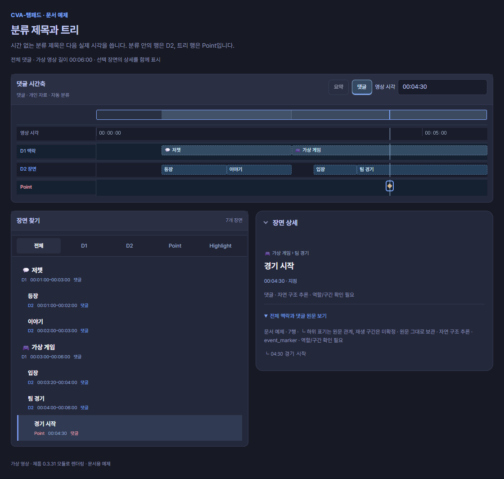
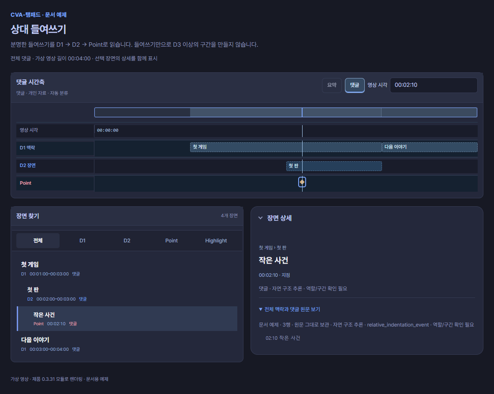
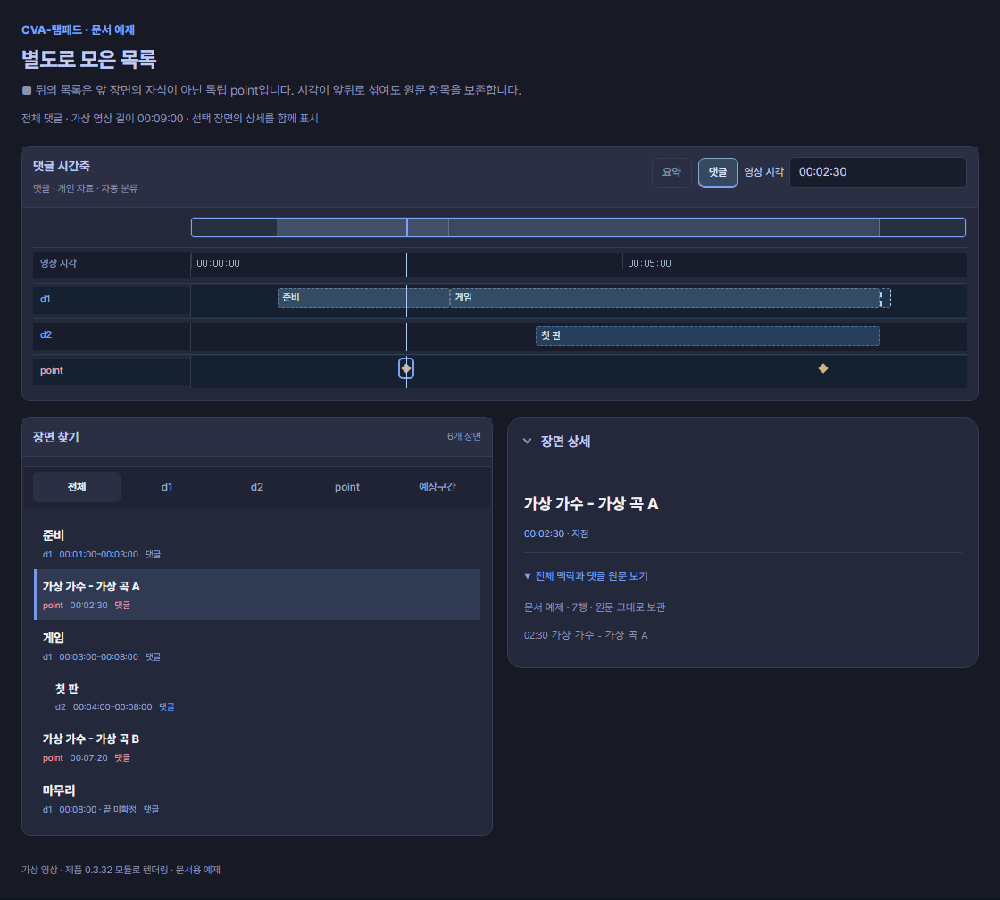
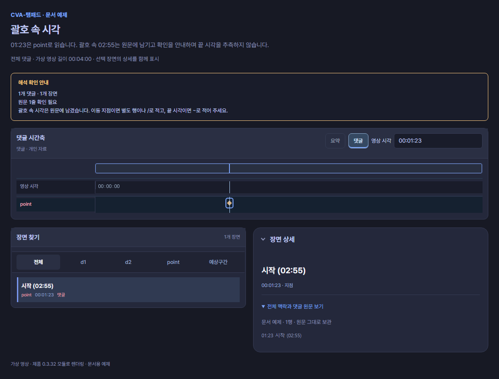
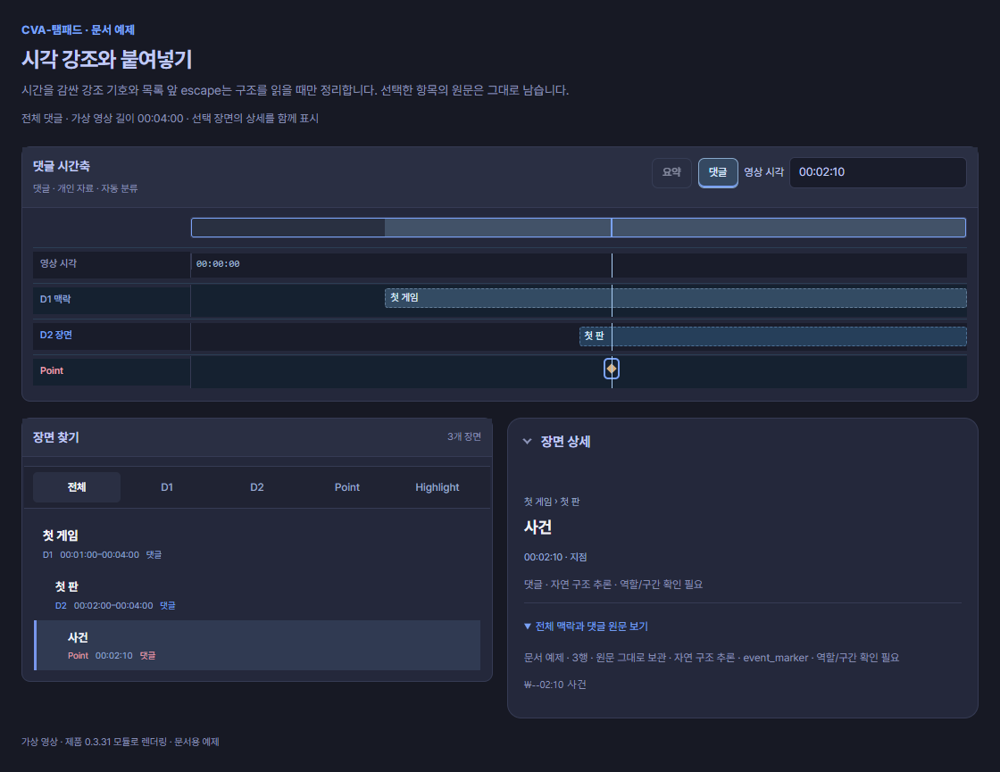

# 기존 댓글 읽기

작성자가 사용한 목록 구조를 읽되, 구조가 모호하면 원문과 이동 시각을 먼저 보존합니다.


## 자연 목차

```text
01:00 준비
03:00 첫 게임
- 04:00 첫 판
--04:30 ⭐ 뜻밖의 사건
- 05:00 두 번째 판
06:00 마무리
```



**화면에서 읽기:** 큰 주제는 D1, 한 단계 목록은 D2, 이중 목록의 04:30은 강조 Point입니다. 원문에 끝이 없는 구간은 확인 가능한 경계에서 계산하며 **자연 구조 추론 · 역할/구간 확인 필요** 안내를 남깁니다.

최상위 행은 **주제 D1**, 단일 목록은 **장면 D2**, 이중 목록은 **순간 Point**로 읽습니다. 명시 `#` 문법에서의 `-`는 계속 순간입니다. 구조 없는 단일 목록도 순간입니다.

```text
💬 저챗
01:00 등장
02:00 이야기
🎮 가상 게임 | 03:00
03:20 입장
04:00 팀 경기
└ 04:30 경기 시작
```



**화면에서 읽기:** 저챗 D1은 다음 실제 시각 01:00에서 시작합니다. 가상 게임 D1은 03:00에서 시작하고, 분류 안의 항목은 D2, 트리의 04:30은 Point로 표시됩니다. 시간 없는 제목 때문에 00:00 항목을 추가하지 않습니다.

시간 없는 `💬 저챗`은 다음 실제 시각 01:00을 시작으로 사용합니다. 분류 안의 행은 장면, 트리 행은 순간입니다. 0초를 만들어 넣지 않습니다. 자유 제목은 모두 분류로 승격하지 않습니다. 지원하는 분류 표식이나 반복된 중첩 목록처럼 구조 근거가 있어야 합니다.

## 명확한 상대 들여쓰기

```text
01:00 첫 게임
  02:00 첫 판
    02:10 작은 사건
03:00 다음 이야기
```



**화면에서 읽기:** 두 칸 안쪽의 첫 판은 D2, 네 칸 안쪽의 작은 사건은 Point입니다. 다음 이야기는 새 D1입니다. 들여쓰기의 깊이를 그대로 D3·D4 구간으로 늘리지 않습니다.

공통으로 붙은 여백을 제외한 뒤, 두 칸 이상·탭·전각 공백처럼 **분명하게 안쪽으로 들어간 시각 행**을 읽습니다. 주제 D1 아래 첫 안쪽 행은 장면 D2, 더 깊은 행은 순간입니다. 들여쓰기만으로 여섯 단계 구간을 발명하지 않습니다.

전체 목록을 똑같이 들여쓴 경우에는 단순 여백입니다. 한 칸의 우연한 공백이나 시간 없는 일반 문장으로 부모를 만들지 않습니다. 자동 구조는 미리보기에서 확인하세요.

## 별도로 모은 목록

```text
01:00 준비
03:00 게임
  04:00 첫 판
08:00 마무리

■
02:30 가상 가수 - 가상 곡 A
07:20 가상 가수 - 가상 곡 B
```



**화면에서 읽기:** 앞부분은 D1/D2 구조, `■` 뒤의 02:30·07:20은 독립된 Point입니다. 음악 항목을 앞 게임의 자식으로 붙이지 않습니다. 화면은 영상 시각 위치에 표시하되 원문 순서와 출처를 보존합니다.

단독 `■`는 새 목록의 경계입니다. 뒤의 음악 목록은 앞 게임의 하위 구간으로 붙이지 않고 **독립된 순간**으로 읽습니다. `---`, `***`, `___` 같은 단독 구분선도 경계로 읽습니다. 일반 문장 속 `■`는 경계가 아닙니다.

곡·공연 목록, 별도로 모은 중요한 순간, 다시 본 장면 색인처럼 시각이 앞뒤로 섞일 수 있습니다. 시간 순으로 되돌아간다는 이유만으로 삭제하지 않습니다. 빈줄은 가독성을 위한 여백이며 독립 목록의 확정 경계가 아닙니다.

## 괄호 속 시각은 확인해 주세요

```text
01:23 시작 (02:55)
```



**화면에서 읽기:** Point는 **01:23 하나**입니다. 02:55 표식이나 01:23–02:55 구간은 만들어지지 않습니다. 괄호 시각 확인 안내와 원문을 미리보기에서 살펴봅니다.

01:23은 이동 지점으로 읽고, `(02:55)`는 원문에 남긴 뒤 **괄호 시각 확인**을 안내합니다. 괄호의 뜻은 실제 시작, 참고 지점, 정정 등으로 다를 수 있어 자동으로 두 번째 항목이나 끝 시각을 만들지 않습니다.

두 이동 지점을 뜻한다면 `01:23 / 02:55 시작`처럼 명시하세요. 시작과 끝이라면 역할이 있는 `01:23 ~ 02:55 [메모] 시작 구간`처럼 적으세요. 기존 댓글을 수정해야 가져올 수 있다는 뜻은 아닙니다. 모호한 부분을 미리보기에서 확인하기 위한 안내입니다.

## 붙여넣기와 원문 보존

```text
**01:00** 첫 게임
- __02:00__ 첫 판
\--02:10 사건
```



**화면에서 읽기:** 시각 강조와 목록 앞 escape를 읽기용 구조에서 정리해 D1·D2·Point를 표시합니다. 원문 표기는 따로 보존합니다. 화면에 보이는 결과가 원문을 수정했다는 뜻은 아닙니다.

강조된 시각과 붙여넣기 과정에서 생긴 목록 기호·공백도 읽을 수 있습니다. 원문은 그대로 남습니다.

## 원글과 답글

선택한 답글은 별도 원문입니다. 원글 관계, 같은 시각의 서로 다른 설명, 오차 안내를 보존합니다. 같은 작성자의 선택한 답글을 이어 읽는 기능에서도 원문 출처는 유지합니다. 다른 사람의 답글은 별도로 확인하세요. 별칭은 선언한 원문 안에서만 적용합니다.

시각만 여러 개 적은 `01:00 02:00 03:00`도 세 순간으로 읽습니다. `첫 장면 [01:00] 두 번째 장면 [02:00]`은 각 설명을 각 시각에 연결합니다.

원글의 작성자를 확인할 수 있는 답글에서는 `@작성자 03:20 장면 설명`처럼 이름 바로 뒤에 붙은 시각도 읽을 수 있습니다. 선택한 원글과 답글의 관계를 함께 확인하세요.
