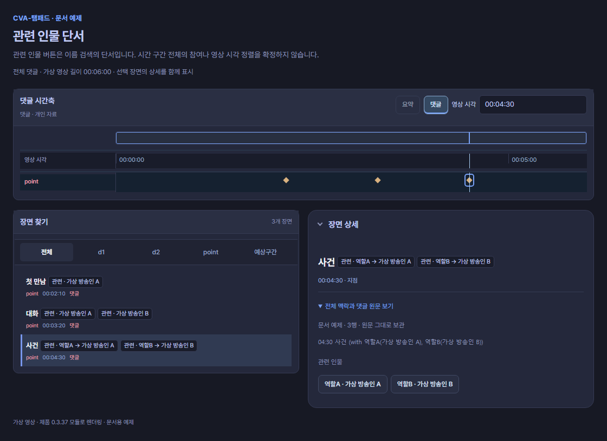
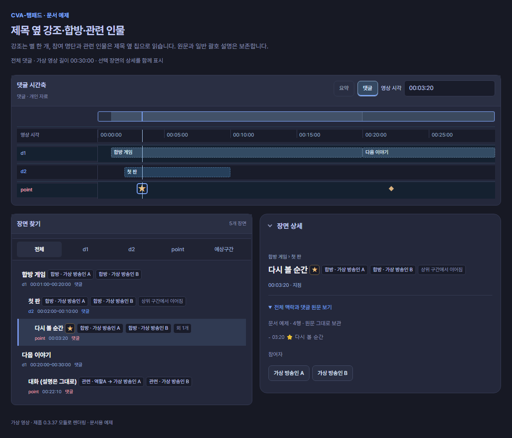
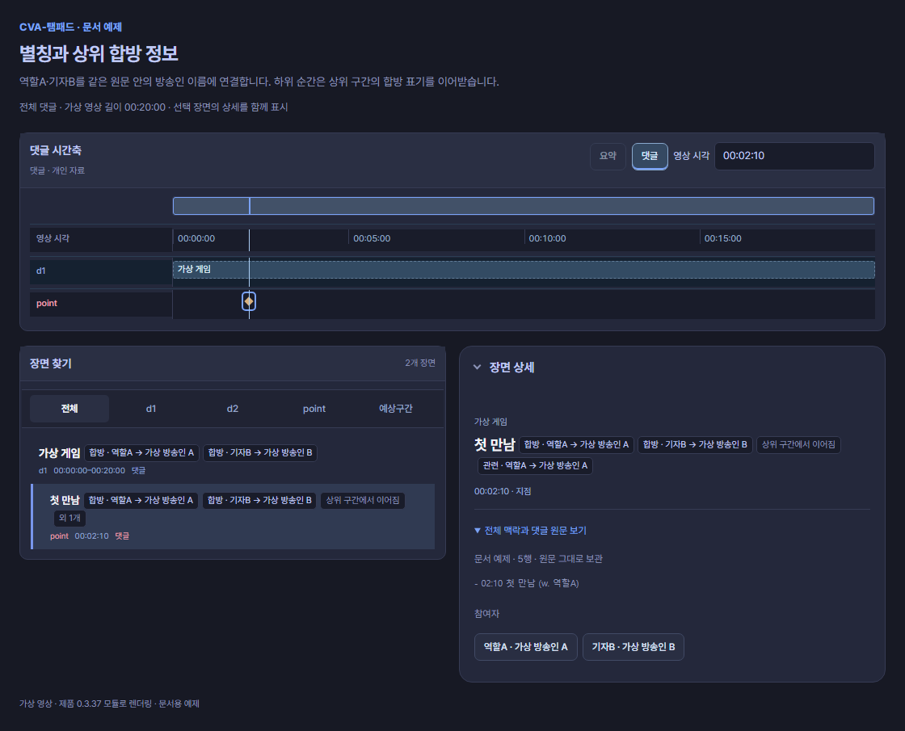

# 인물과 합방

최상단에 **`합방 : 이름A, 이름B` 한 줄**만 적어도 방송인을 자동 검색하고 겹치는 다시보기를 불러옵니다. 한 장면에만 관련된 이름은 `w.`로 적으세요.


## 최상단 한 줄로 비교 영상 찾기

```text
합방 : 가상 방송인 A, 가상 방송인 B
```

**이 한 줄만 있어도 됩니다.** 댓글 맨 위에 쓰고 **합방 명단 불러오기**를 누르세요. 시간표와 함께 쓸 때는 같은 줄 아래에 시각 목록을 이어 적으면 됩니다. 콜론 앞뒤 공백과 이름 사이 공백을 허용합니다. `함께 :`, `참여 :`도 쓸 수 있습니다.

명단의 방송인을 검색하고 조회 범위와 방송 시간대가 겹치는 공개 다시보기 후보를 불러옵니다. 방송이 여러 영상으로 나뉘었으면 확인한 영상들을 함께 등록합니다. 조회가 일부만 끝난 경우에는 그 상태를 표시하며, 못 찾았다는 이유로 영상이 없다고 판단하지 않습니다. **합방 영상**에서 이름을 눌러 비교 영상을 열고, 장면이 어긋나면 **시각 보정**으로 맞추세요.

최상단 명단은 댓글 전체의 **비교할 사람 목록**입니다. 시간이 없으므로 0초 장면이나 확정 참여 구간을 만들지 않습니다. 상단 댓글을 자동으로 가져오는 경우도 읽으며, 이미 저장한 작업이나 작성 중인 입력은 유지합니다. 표시 중인 명단의 처음 12명을 조회하며, **더보기**로 다음 12명을 이어 찾습니다. 같은 이름·검증된 채널의 완료된 조회는 재사용합니다. 연결되지 않은 사람은 이름을 눌러 확인할 수 있습니다.

## 구간에 참가자 명단 붙이기

제목 바로 아래에 **`합방: 이름 A, 이름 B`**를 적습니다. 이름은 쉼표로 나눕니다.

```text
# 01:00 ~ 20:00 합방 게임
합방: 가상 방송인 A, 가상 방송인 B
## 02:00 ~ 10:00 첫 판
- 03:20 다시 볼 순간
```

**명단·관련 인물 읽기 → 방송인 자동 검색 → 겹치는 다시보기 자동 불러오기 → 비교 영상 열기** 순서입니다.

1. 댓글을 **시간축에 불러오기**로 적용합니다. 상위 댓글을 자동으로 불러온 경우에도 같은 방식으로 읽습니다.
2. 현재 구간에 적힌 명단을 그 순서대로 처음 12명까지 조회합니다. **더보기**마다 다음 12명을 이어 조회하고 펼칩니다. 공개 메타데이터로 방송 시간대가 겹치는 다시보기 후보를 확인하며, 같은 방송인의 분할 영상도 함께 등록합니다.
3. **합방 영상**에서 이름·영상 목록을 확인하고, 이름 칩을 눌러 비교 영상을 엽니다. 동명이인이거나 방송인이 다르게 잡히면 직접 선택하세요.
4. 같은 장면의 시각이 어긋나면 **시각 보정**으로 맞춥니다.

제목 한 줄에 `# 01:00 ~ 20:00 합방 게임 (합방: 가상 방송인 A, 가상 방송인 B)`처럼 명단을 붙여도 됩니다.

이 예제의 명단은 01:00–20:00에 적용되고, 그 아래 첫 판과 순간에도 이어집니다. 새 주제나 별도 목록에는 이어지지 않습니다. `함께:`, `참여:`도 같은 방식으로 명단을 적을 수 있습니다.

찾은 이름과 영상은 재사용합니다. 구간을 이동하거나 **더보기**를 누르면 새로 표시할 명단을 이어 조회하므로, 이미 완료한 같은 이름을 매번 다시 찾지는 않습니다. 아직 영상이 연결되지 않은 이름은 눌러 찾거나 **합방 영상 다시 조회**를 사용하세요. **합방 조회 취소**는 진행 중 조회를 멈추고 등록한 영상과 수동 선택을 유지합니다.

## 현재 멤버와 전체 멤버

- 기본 화면은 **현재 합방 구간의 명단 순서**입니다. 이전 구간 멤버를 현재 명단 상단에 남기지 않습니다.
- **전체 멤버**는 유효 구간의 시작 시각과 원래 명단 순서에 따른 **첫 등장 순서**입니다. 조회 응답 순서나 방송 시작 시각으로 멤버를 재정렬하지 않습니다.
- 두 화면 모두 처음 12명, **더보기** 다음 12명입니다. 원본 영상은 맨 위의 별도 행이며 12명에 포함하지 않습니다. 마지막 묶음이 12명보다 적으면 남은 사람만 불러옵니다.
- 시각이 있는 합방 구간 자료가 있으면 문서 전체 명단·수동 검색 명단은 조회 보조 자료로 유지하고, 현재 참석 명단을 늘리지 않습니다. `없음`·`미확인`·구간 밖에서는 그 구간의 참여자를 추측하지 않습니다.
- 구간 자료 없이 문서 전체·수동 명단만 입력한 경우는 그 명단으로 조회할 수 있습니다. 현재 구간 밖에서 직접 열어 보고 있는 비교 영상은 현재 명단 뒤에서 확인할 수 있으며, 자동 조회만으로 재생 영상을 바꾸지 않습니다.

## 이름 확인과 공개 다시보기 조회

자동 이름 발견 단계에서는 **팔로워 수가 확인된 100명 이하 채널**을 제외합니다. 유일한 정확한 이름 일치 후보를 우선하고, 그렇지 않으면 상단 유효 후보 5개의 팔로워 수가 모두 확인되었을 때 유일한 최댓값을 자동 후보로 선택합니다. 동률·수치 부재에서 순위만 보고 임의 선택하지 않습니다. 정확한 이름이 아닌 후보는 신원 미확인 상태를 남기므로 방송인이 맞는지 확인하거나 직접 선택하세요. 이 규칙은 이미 직접 선택한 방송인이나 명시 VOD 링크를 대신하지 않습니다.

기존 ttaem.com 자료에 연결된 VOD가 있으면 공식 공개 메타데이터로 채널과 방송 기간을 검증해 먼저 보존합니다. 한 영상을 찾았거나 기존 링크가 전체 시간을 덮어도 조회 범위의 다른 다시보기 목록을 계속 확인합니다. 링크 자료가 없어도 **선택해 채택한 댓글이나 복원한 저장 댓글의 합방 명단**으로 조회할 수 있습니다. 새 원문을 입력하거나 미리보기만 했다고 저장 댓글·컷·수동 선택·시각 보정을 덮어쓰지 않습니다.

같은 방송인에게 공개 다시보기가 여러 개 있으면 **검증된 채널별 한 행**에서 방송 시간순으로 표시합니다. 분할 영상 사이의 빈 시간은 그대로 남깁니다. 각 영상의 보정은 원본·해당 비교 VOD 조합별로 유지합니다.

조회는 한 번에 2명의 이름을 처리하며 시간·페이지 제한, 취소나 일부 상세 정보 실패가 있으면 **일부 조회**로 표시합니다. 이때 먼저 확인한 영상과 수동 선택을 유지합니다. 못 찾은 영상을 존재하지 않는다고 판단하지 않으며, 필요하면 이름을 직접 확인하고 다시 조회하세요.

공개 성인 영상 메타데이터는 조회 후보로 사용할 수 있고 **성인 표시**를 유지합니다. 유료·멤버십·차단 영상은 자동 공개 조회에서 제외합니다. 실제 재생은 공식 로그인·성인 확인·접근 조건을 그대로 따르며, 공개 조회가 재생 권한을 만들지는 않습니다.

## 빈 구간을 누르면

멤버 행에서 영상이 없는 빈 구간이나 시각 미확인 영역을 누르면 **원본 영상만 해당 시점으로 이동**합니다. 비교 영상을 추측해 선택하거나 소리 출처·재생 의도를 바꾸지 않습니다. 해당 시각을 포함하는 확인된 영상 구간을 누르면 그 분할 VOD로 비교할 수 있습니다. 가로로 스크롤해도 방송인 이름과 소리 버튼은 왼쪽에 유지됩니다.

방송 시작 시각과 영상 길이로 계산한 겹침은 같은 사건·정확한 정렬을 확인한 결과가 아닙니다. 원본과 비교 영상을 보며 **시각 보정**으로 맞추세요.

## 합방 표기 고르기

| 원하는 것 | 표기 예제 | 앱에서 읽는 정보 |
|---|---|---|
| 댓글 전체 비교 명단 | 맨 위의 `합방 : A,B` 한 줄 | 방송인 자동 검색 · 겹치는 다시보기 자동 불러오기 |
| 구간의 참가자 명단 | `합방: A, B` · `함께: A, B` · `참여: A, B` | 해당 구간과 하위 장면에 이어지는 명단 |
| 제목 안의 명단 | `# 01:00 게임 (합방: A, B)` | 제목 구간의 명단 |
| 한 장면의 관련 인물 | `02:10 만남 (w. A)` | A를 자동 검색하고 겹치는 다시보기 불러오기 |
| 여러 관련 인물 | `(w/ A, B)` · `(with A, B)` | A·B를 각각 자동 검색하고 겹치는 다시보기 불러오기 |
| 접두어 없는 괄호 명단 | `02:10 만남 (A, B)` | 마지막 괄호의 두 명 이상을 자동 검색하고 겹치는 다시보기 불러오기 |
| 역할과 방송인 연결 | `(w. 역할A(방송인A))` | 역할A를 표시하고 방송인A로 조회 |
| 합방 구간의 종류 | `- 01:00 ~ 05:00 [합방] 게임` | 범위 표시. 이름은 다음 행에 `합방:`으로 적기 |

구간에 붙인 명단은 **그 구간의 참여자**, 최상단 명단은 **문서 전체 비교 조회 목록**, `w.` 등의 괄호는 **해당 장면의 관련 인물 단서**를 적습니다. 두 표기 모두 자동 검색·다시보기 불러오기를 지원합니다. `합방: 없음`과 `합방: 미확인`은 아래에서 설명합니다.

## 관련 인물 단서

```text
02:10 첫 만남 (w. 가상 방송인 A)
03:20 대화 (w/ 가상 방송인 A, 가상 방송인 B)
04:30 사건 (with 역할A(가상 방송인 A), 역할B(가상 방송인 B))
```



**화면에서 읽기:** 세 시각은 각각 point입니다. 관련 인물은 제목 옆 칩으로 보이고, 역할A·역할B와 연결한 이름을 함께 확인할 수 있습니다. 이 이름들은 비교 조회 단서이며 구간 전체의 참석을 확정하지 않습니다. 표시 중인 명단과 **더보기**에 따라 겹치는 공개 다시보기 후보를 조회하고 완료한 같은 이름은 재사용합니다.

`w.`, `w/`, `with`는 대소문자를 구분하지 않습니다. 닫힌 괄호 뒤의 설명도 원문에 남깁니다. 명시 with 괄호를 우선하며, with가 없는 마지막 명단 괄호는 두 명 이상일 때 검색 단서로 읽습니다. 쉼표는 가장 바깥 수준에서만 이름을 나눕니다. `역할A(가상 방송인 A)`는 역할A를 화면 표기로, 가상 방송인 A를 검색어로 사용합니다. 여러 이름이 들어 있는 내부 괄호는 한 사람의 가명으로 확정하지 않습니다.

`w.`는 **해당 장면의 관련 인물**, `합방:`, `함께:`, `참여:`는 **구간의 참여자 명단**을 적는 표기입니다. 명시한 명단은 하위 장면에도 이어집니다. 불러온 비교 영상의 같은 장면이 어긋나면 **시각 보정**으로 맞추세요.

## 앱에서 제목과 인물 읽기

```text
# 01:00 ~ 20:00 합방 게임
합방: 가상 방송인 A, 가상 방송인 B
## 02:00 ~ 10:00 첫 판
- 03:20 ⭐ 다시 볼 순간
# 20:00 ~ 30:00 다음 이야기
- 22:10 대화 (w. 역할A(가상 방송인 A), 가상 방송인 B) (설명은 그대로)
```



**장면 찾기·장면 상세:** 제목 옆에 강조와 인물 칩이 이어집니다. 선택한 순간에는 **★**와 `합방 · 이름`, `상위 구간에서 이어짐`이 보입니다. ★에 마우스를 올리면 **작성자 강조**를 확인할 수 있습니다. 마지막 제목은 **대화 (설명은 그대로)**로 보이고, 인물은 `관련 · 역할A → 가상 방송인 A`, `관련 · 가상 방송인 B` 칩으로 나뉩니다.

목록에는 칩을 최대 세 개까지 보여 주고, 나머지는 `외 N개`로 묶습니다. 장면 상세에서 모두 볼 수 있습니다. 일반 괄호 설명과 괄호 속 시각은 제목에 남깁니다. **전체 맥락과 댓글 원문 보기**에서는 원래 댓글을 그대로 확인할 수 있습니다.

## 한 원문 안에서 가명을 연결하기

```text
별칭: 역할A = 가상 방송인 A
별칭: 기자B = 가상 방송인 B
# 00:00 ~ 20:00 가상 게임
합방: 역할A, 기자B
- 02:10 첫 만남 (w. 역할A)
```



**화면에서 읽기:** d1의 명시 합방 명단은 가상 방송인 A·B로 연결되고, 하위 point에도 **같은 명단이 이어집니다**. 상세의 부모 맥락과 참여자 이름을 함께 확인하세요. point의 `w. 역할A`는 가상 방송인 A로 자동 검색됩니다. 부모의 합방 명단과 해당 순간의 관련 인물은 각각 칩으로 표시합니다.

`별칭:` 행은 시간을 만들지 않습니다. 별칭은 같은 원문 문서에만 적용합니다. 같은 작성자의 답글을 이어 읽어도 다른 답글에서 선언한 별칭으로 앞 원문의 이름을 바꾸지 않습니다. 부모의 명시 명단을 상속할 때에는 **명단을 선언한 원문**의 별칭을 사용합니다.

같은 원문에서 한 별칭이 서로 다른 방송인에게 연결되면 충돌입니다. 첫 번째 이름을 선택하거나 자동 조회하지 않습니다. 원문을 보존하고 작성자 또는 사용자가 연결을 수정해야 합니다. 같은 시각·같은 이름의 원문 행도 삭제하지 않습니다.

파일로 별칭을 가져올 수도 있습니다. [파일 예제 보기](files.md)

## 다른 시점의 영상 확인하기

댓글을 고치지 않고 이름을 추가하려면 [한 줄 입력·참가자 파일](files.md#참가자와-역할-이름-가져오기)을 사용하세요.

이름이 모호하면 방송인을 직접 선택합니다. 기준 영상과 방송 시각이 겹치는 다시보기를 찾고, 여러 영상으로 나뉘었다면 해당 다시보기를 고를 수 있습니다. 같은 장면이 어긋나면 **시각 보정**으로 맞추세요.

## 합방이 없거나 아직 모를 때

`합방: 없음`은 참여자가 없다는 뜻이고, `합방: 미확인`은 아직 모른다는 뜻입니다. 이름을 임의로 찾지 않습니다. 한 구간에 서로 다른 명단을 반복해서 적으면 확인 안내가 나타납니다. 문서 전체·수동 검색 명단이 있더라도 이 구간에 참석한다고 채워 넣지 않습니다.
