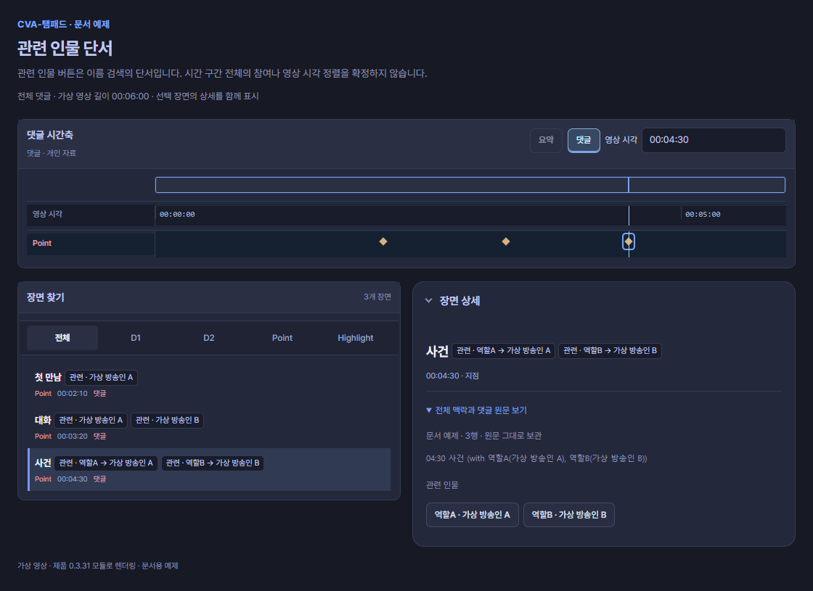

# 인물과 합방

합방 명단을 적으면 방송인과 겹치는 다시보기를 자동으로 찾을 수 있습니다. 먼저 `합방:`을 쓰고, 한 장면에만 관련된 이름은 `w.`로 적으세요.


## 합방 명단으로 비교 영상 찾기

제목 바로 아래에 **`합방: 이름 A, 이름 B`**를 적습니다. 이름은 쉼표로 나눕니다.

```text
# 01:00 ~ 20:00 합방 게임
합방: 가상 방송인 A, 가상 방송인 B
## 02:00 ~ 10:00 첫 판
- 03:20 다시 볼 순간
```

**합방 명단 → 방송인 자동 조회 → 겹치는 다시보기 목록 → 이름을 눌러 비교 영상 열기** 순서입니다.

1. 댓글을 **시간축에 불러오기**로 적용합니다. 상위 댓글을 자동으로 불러온 경우에도 같은 방식으로 읽습니다.
2. 현재 보거나 선택한 장면이 합방 구간에 있으면, 명단의 방송인과 **기준 영상의 방송 시간에 겹치는 다시보기**를 자동으로 찾습니다. 방송이 여러 영상으로 나뉘었으면 겹치는 영상들이 목록에 함께 나타납니다.
3. **합방 영상**에서 이름·영상 목록을 확인하고, 이름 칩을 눌러 비교 영상을 엽니다. 동명이인이거나 방송인이 다르게 잡히면 직접 선택하세요.
4. 같은 장면의 시각이 어긋나면 **시각 보정**으로 맞춥니다.

이 예제의 명단은 01:00–20:00에 적용되고, 그 아래 첫 판과 순간에도 이어집니다. 새 주제나 별도 목록에는 이어지지 않습니다. `함께:`, `참여:`도 같은 방식으로 명단을 적을 수 있습니다.

목록에 이름이 남았지만 영상이 없으면 이름을 눌러 찾거나 **다시 조회**를 사용하세요. 자동 조회로 찾은 방송인과 영상이 맞는지는 목록에서 확인할 수 있습니다.

## 관련 인물 단서

```text
02:10 첫 만남 (w. 가상 방송인 A)
03:20 대화 (w/ 가상 방송인 A, 가상 방송인 B)
04:30 사건 (with 역할A(가상 방송인 A), 역할B(가상 방송인 B))
```



**화면에서 읽기:** 세 시각은 각각 Point입니다. 인물 이름은 **참가자 후보**로 남고, 역할A·역할B와 실제 이름의 대응을 함께 확인할 수 있습니다. 이것만으로 합방 구간 막대·영상 연결·시각 정렬을 만들지는 않습니다.

`w.`, `w/`, `with`는 대소문자를 구분하지 않습니다. 닫힌 괄호 뒤의 설명도 원문에 남깁니다. 명시 with 괄호를 우선하며, with가 없는 마지막 명단 괄호는 두 명 이상일 때 검색 단서로 읽습니다. 쉼표는 가장 바깥 수준에서만 이름을 나눕니다. `역할A(가상 방송인 A)`는 역할A를 화면 표기로, 가상 방송인 A를 검색어로 사용합니다. 여러 이름이 들어 있는 내부 괄호는 한 사람의 가명으로 확정하지 않습니다.

이 표기는 **관련 인물 후보**입니다. 도구가 장면 안에서 이름을 보여줄 수 있지만 그 사람이 구간 전체에 참여했다는 뜻은 아닙니다. `합방:`, `함께:`, `참여:`로 명시한 참여자 목록과 구별합니다. 명시 목록은 기존 제목 부모 상속 규칙을 따릅니다.

## 한 원문 안에서 가명을 연결하기

```text
별칭: 역할A = 가상 방송인 A
별칭: 기자B = 가상 방송인 B
# 00:00 ~ 20:00 가상 게임
합방: 역할A, 기자B
- 02:10 첫 만남 (w. 역할A)
```


**화면에서 읽기:** D1의 명시 합방 명단은 가상 방송인 A·B로 연결되고, 하위 Point에도 **같은 명단이 이어집니다**. 상세의 부모 맥락과 참여자 이름을 함께 확인하세요. Point의 `w. 역할A`는 가상 방송인 A라는 후보 단서입니다. 부모의 명시 명단 상속과 Point의 후보 이름은 서로 다른 정보입니다.

`별칭:` 행은 시간을 만들지 않습니다. 별칭은 같은 원문 문서에만 적용합니다. 같은 작성자의 답글을 이어 읽어도 다른 답글에서 선언한 별칭으로 앞 원문의 이름을 바꾸지 않습니다. 부모의 명시 명단을 상속할 때에는 **명단을 선언한 원문**의 별칭을 사용합니다.

같은 원문에서 한 별칭이 서로 다른 방송인에게 연결되면 충돌입니다. 첫 번째 이름을 선택하거나 자동 조회하지 않습니다. 원문을 보존하고 작성자 또는 사용자가 연결을 수정해야 합니다. 같은 시각·같은 이름의 원문 행도 삭제하지 않습니다.

파일로 별칭을 가져올 수도 있습니다. [파일 예제 보기](files.md)

## 다른 시점의 영상 확인하기

댓글을 고치지 않고 이름을 추가하려면 [한 줄 입력·참가자 파일](files.md#참가자와-역할-이름-가져오기)을 사용하세요.

이름이 모호하면 방송인을 직접 선택합니다. 기준 영상과 방송 시각이 겹치는 다시보기를 찾고, 여러 영상으로 나뉘었다면 해당 다시보기를 고를 수 있습니다. 같은 장면이 어긋나면 **시각 보정**으로 맞추세요.

## 합방이 없거나 아직 모를 때

`합방: 없음`은 참여자가 없다는 뜻이고, `합방: 미확인`은 아직 모른다는 뜻입니다. 이름을 임의로 찾지 않습니다. 한 구간에 서로 다른 명단을 반복해서 적으면 확인 안내가 나타납니다.
