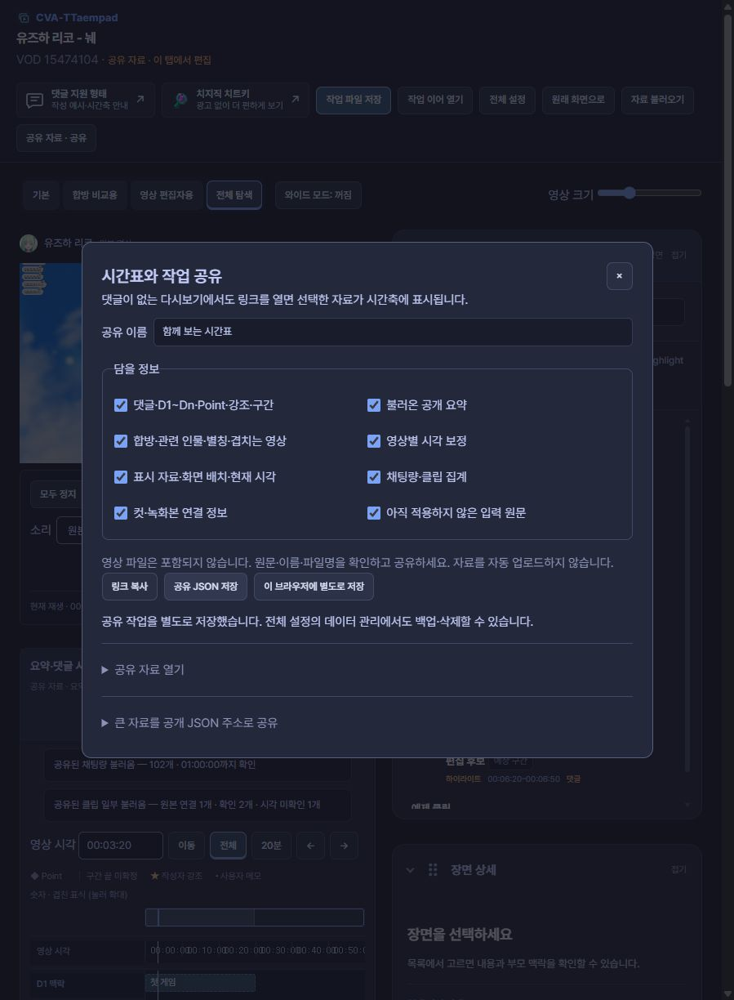
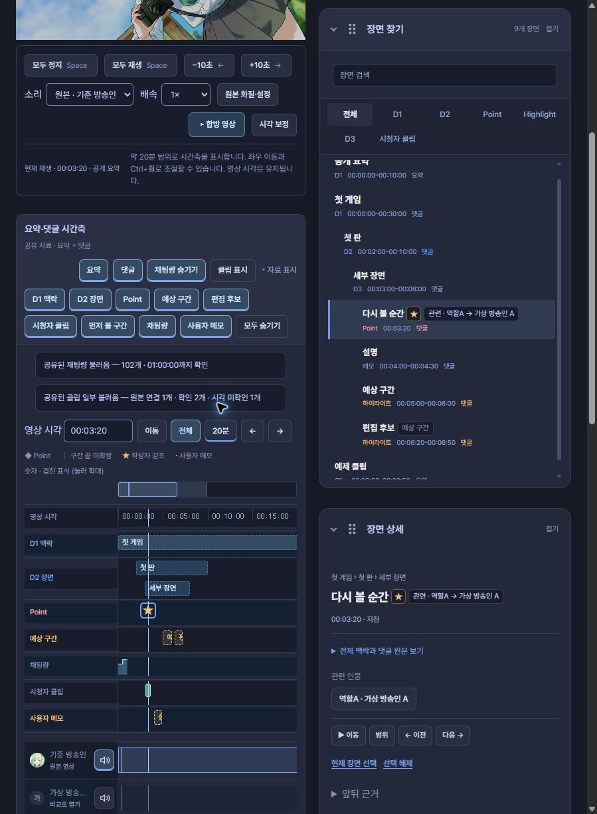
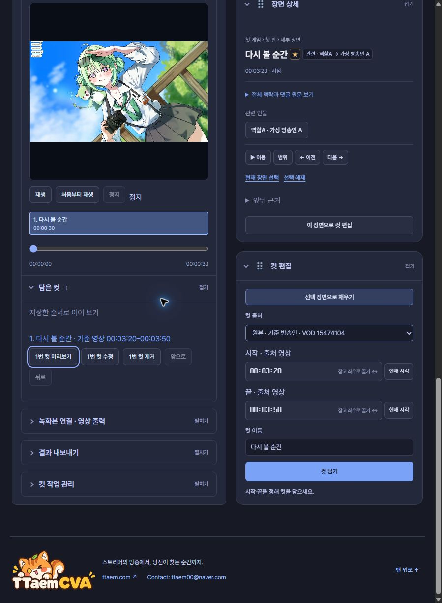

# 링크로 시간표 공유하기

**댓글이 없는 다시보기에도 시간표와 합방 정보를 붙여 볼 수 있습니다.** 작업실의 **공유**에서 링크를 만들고, 탬패드가 설치된 Chrome에서 열면 같은 다시보기의 공유 작업실이 열립니다.

## 보내는 사람

1. 원하는 댓글·요약을 시간축에 불러옵니다.
2. 상단 **공유**를 눌러 이름과 담을 정보를 고릅니다.
3. **링크 복사**를 눌러 전달합니다.

집계나 컷을 함께 보내려면 **채팅량·클립 집계**, **컷·녹화본 연결 정보**를 선택하세요. 입력 중인 원문은 별도 선택 항목입니다.

## 담을 수 있는 정보

| 정보 | 함께 전달되는 내용 |
|---|---|
| 댓글 | 원문·여러 문서, D1~Dn·Point, 별 강조, 메모·예상 구간, 설명·원본 구간 |
| 공개 요약 | 앱에 불러온 요약의 목차와 자료 |
| 인물·합방 | 이름·별칭·관련 인물, 찾은 겹치는 다시보기, 숨긴 인물 |
| 시각 보정 | 영상별로 맞춘 보정값 |
| 채팅량·클립 | 수집한 집계와 시점, 완료·일부 수집 상태 |
| 컷 작업 | 출처 영상·시작·끝·순서·이름, 녹화본 연결 정보와 출력 선택 |
| 화면 | 표시할 자료, 검색·선택 장면, 패널 순서, 시간축 범위·현재 시각 |

**영상 파일은 전달되지 않습니다.** 녹화본을 사용하려면 받는 사람이 파일을 다시 연결합니다. 원문·이름·파일명을 확인하고 공유하세요.

## 받는 사람

공유 링크를 열면 상단에 **공유 자료 · 이 탭에서 편집**이 표시됩니다. 기존에 저장한 댓글·컷을 덮어쓰지 않고 볼 수 있습니다. 영상은 자동으로 함께 재생하지 않습니다.

이미 작업실을 열고 있었다면 공유 내용이 먼저 안내됩니다. 입력 중인 원문을 파일로 보관한 뒤 **이 자료로 작업실 열기**를 누르세요.

**이 브라우저에 별도로 저장**을 누르면 해당 영상의 마지막 공유 작업을 보관합니다. 다음에는 **공유 → 공유 자료 열기 → 저장한 공유 열기**로 이어 볼 수 있습니다. 전체 설정의 데이터 관리에서도 백업·삭제할 수 있습니다.

## 링크가 너무 길다면

선택한 정보를 빼지 않고 **공유 JSON 저장**으로 전달하세요. 받는 사람은 해당 다시보기의 **공유 → 공유 자료 열기**에서 JSON 파일을 선택합니다. 파일만 골랐을 때는 현재 작업이 바뀌지 않습니다.

공개 주소를 사용하는 방법도 있습니다. 공유 JSON을 **ttaem.com 또는 이 공개 가이드의 HTTPS JSON 주소**에 올린 뒤 **큰 자료를 공개 JSON 주소로 공유**에 주소를 넣습니다. 로그인 없이 읽을 수 있는 파일이어야 합니다. 공유 메뉴가 파일을 자동 업로드하지는 않습니다.

링크는 8,192자까지, 공유 JSON은 16 MiB까지 지원합니다. 브라우저에 별도 저장할 자료는 8 MiB 이하입니다. 일반적인 댓글 시간표는 링크로 전달하고, 큰 집계·컷 작업은 JSON 파일로 전달하면 편합니다.

## 실제 시간축 예제

아래는 **합성 시간표를 실제 설치된 앱으로 연 화면**입니다. 영상의 실제 내용·참여 명단과는 무관한 예제입니다. D1·D2·상세 구간·Point의 별, 예상 구간·편집 후보·메모와 집계를 함께 볼 수 있습니다.

[예제 공유 링크 열기](https://chzzk.naver.com/video/15474104#ttaempad=1g.H4sIAAAAAAAACo1WX2sbRxD_Ksv4pYWzOUl2nB6UksQPCaVNqKF9sIVY342lbVa7x96e3NioxEQpoQnFgYSGxgkpOGncJmBipzi0_TJ91J2_Q5m901mx5VC9aHdnd_785jcztwFJ2MEuhwDCHp-2lmM35tFM0uEGZ3o18KCHJhFaQVDzwAorEQI4evhy-Ncjlu0fZD8-YPnd7eHe4Oj-NnjA4_jr0QPwZxozjTp4sMIThGADeiJC_aWGAGpzs_OzNX8WPAilDq9DAD0dtRIMtYoS8CBKDbdCq0UMIWic8_2-B6HudlHZhFRFOkzLzdIGGL7m3NrN9nYDNty7md_aZNnebv7Dr_mTQ3bBO312cVll-4P83euA5T-_Pnr47AL7dMLLZTXFfD_wffY9a7j__M0fbPjmXv50sKympphfL4S1Snh0b4skU8xvFCL_vBMNDrM_b7L86fNs92BZTZO47rN_X2-x7O5OfnebZft_s_wOgck-WpsZufWxuztbqpoNGj5b-qLJ8sFO9vttJ5srZefof-lyk-WP7lAYw7evhnsDd-UcmXJX5ujKZ0129NNh_tt9dvR4kO0fgAM3lmhRYZIQHcot9JseRIavWkK9wDl_ejt79pzlO_dZ_ngre3VIiQ9DjC1GX7kb4EGMKhKqvTCWp2a_70GcrkgRLnDLSWFBv1ZFMugJXEPTwkhYbVpWa5mUPCTutNQJ8oxoQswpeOIB73Eh-Qox1ZoUPdCplUJhKzb6WwytM7S0ASKCoHSHDEjsoYQAFmgzYvpw_-1wb5vlvzzIH_4DHiSWG1sY8z1AFRVr4mfTA-yNIvUg7HDbWknD61jGTpDoWLpC6HKVcnkMAAHeWV-_PhNzY0UoYq7stNGJRXOiBLvYXUFTsD6xBnkXDfl5irjQ9z5846JLLZeCJ1joc2vKb0E8F-4HLVBQpZfBBpTwXiFY8TtO_BlDMns3GL7dYvmjzfzWJhyDMUpET0fTY4lVvOvwP9zLd24eWx0RYWITuWpEWxBMvvsRAO-p9uc_mR9TfTqgk8rLB5OUT-pQBIeIUFlhRQnpWbYunrR1vj5Xq7mMdEQUITEU8jsvh4cHLH9ykL0YQNM5kmBEouoF2bSiK1Tb2Zvof4TScudmbaY-59qxoDy7Lh-1YjSJVlw664loKy5diyUGj_7HmLxxVhE0fOoiqbIQNOoF-6p7jferpbo4X6AWShEnx1ygbVBSqAaFuJWKMWKNF-wlKeIxolHze7bNjjYPshcnSrbuj7tRb7iiDXUPDW_jeMiJ5TYdb4MRUOklCW_jpcLzml8_frtYzq1qUhXxjClyhc0leGAw0bKH0UiPB0nIlaoO6h6k6uSlPrXOMC1mX9EzqjlbP6MmDIbaRIs6NSFOlkGgUimpFokBpHpSKfZ0RKI1LuUFFXa0WSwz39PR-EHFxKurqwna6rCwJVSbnB_fXxv1wyq2igCpna7ByLErE5yqlDih1KHDVhTV6PKs08KFOnHvtGMeKG1dYzo5fIkzDrQzP1kkX3HMK7tT1dNOQzRqEiUziG9CxWUehftI8gP3IQDO4-pgjg7-h4fHbhGIqwaCVS4T9GAdjS43fc-NVTIp-Y3CCn4XS22oQa-JCKtXLtxFsY4QzBawIY3Ob4SK9FrF8lJyjHUSosJF5CbsFNPfHXwuFCWHS0d7NyfG70h-w02yDRq55aheqI9W17Qg5heby6LdkaLdqQ4uuUIt11T_bt2n_hXhCjdXTURDaalwxH1QouWCHAlTC81-_z_TwYRB-woAAA) · [공개 JSON 주소로 열기](https://chzzk.naver.com/video/15474104#ttaempad-ref=eyJ2ZXJzaW9uIjoxLCJ2aWRlb05vIjoiMTU0NzQxMDQiLCJ1cmwiOiJodHRwczovL3R0YWVtMDAuZ2l0aHViLmlvL2N2YS10dGFlbXBhZC10aW1lbGluZS1zcGVjL2Fzc2V0cy9leGFtcGxlcy9zaGFyZS13b3Jrc3BhY2UuanNvbiJ9)

[공유 JSON 예제 받기](../assets/examples/share-workspace.json)

컷의 출처·시작·끝과 담은 순서도 함께 복원됩니다. 아래는 예제의 30초 컷을 받은 화면입니다.

시각 보정은 보낸 사람이 맞춘 값입니다. 같은 순간인지 두 영상을 보며 확인할 수 있습니다. 광고·로그인·접근 제한은 원래 다시보기의 이용 조건을 따릅니다.

[시간축 용어](timeline.md) · [파일 형식](files.md) · [문의·오류 제보](contact.md)
