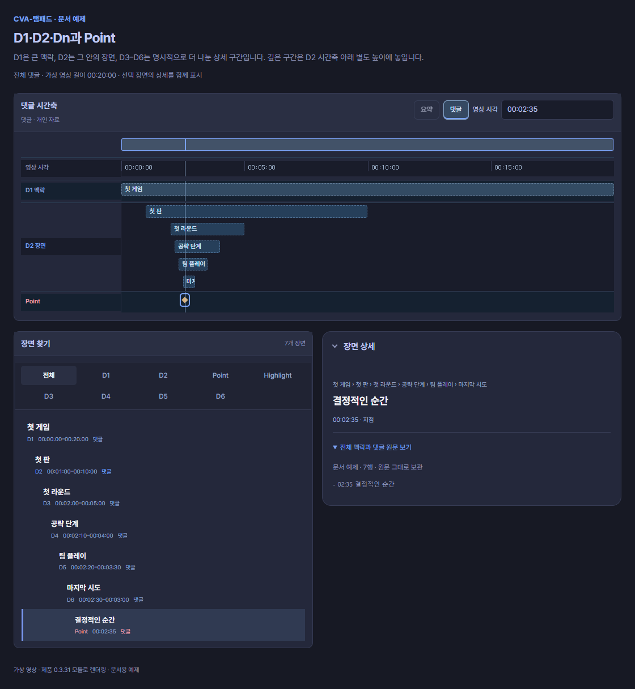
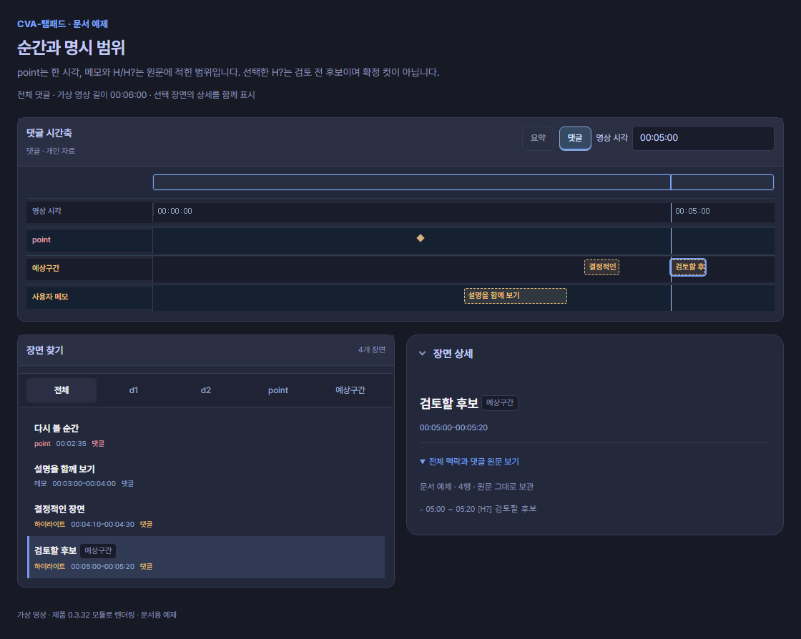
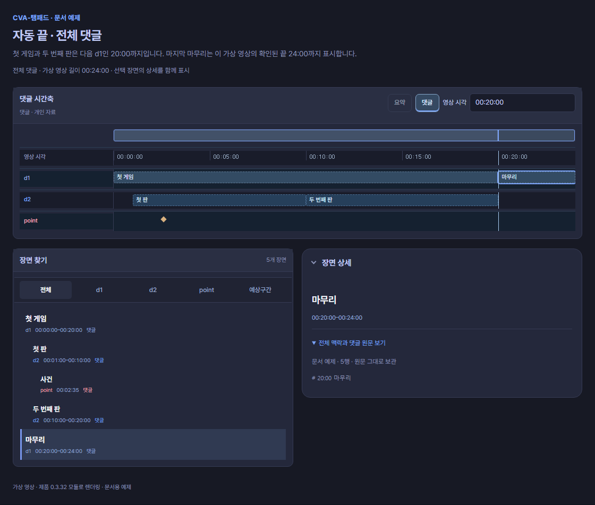
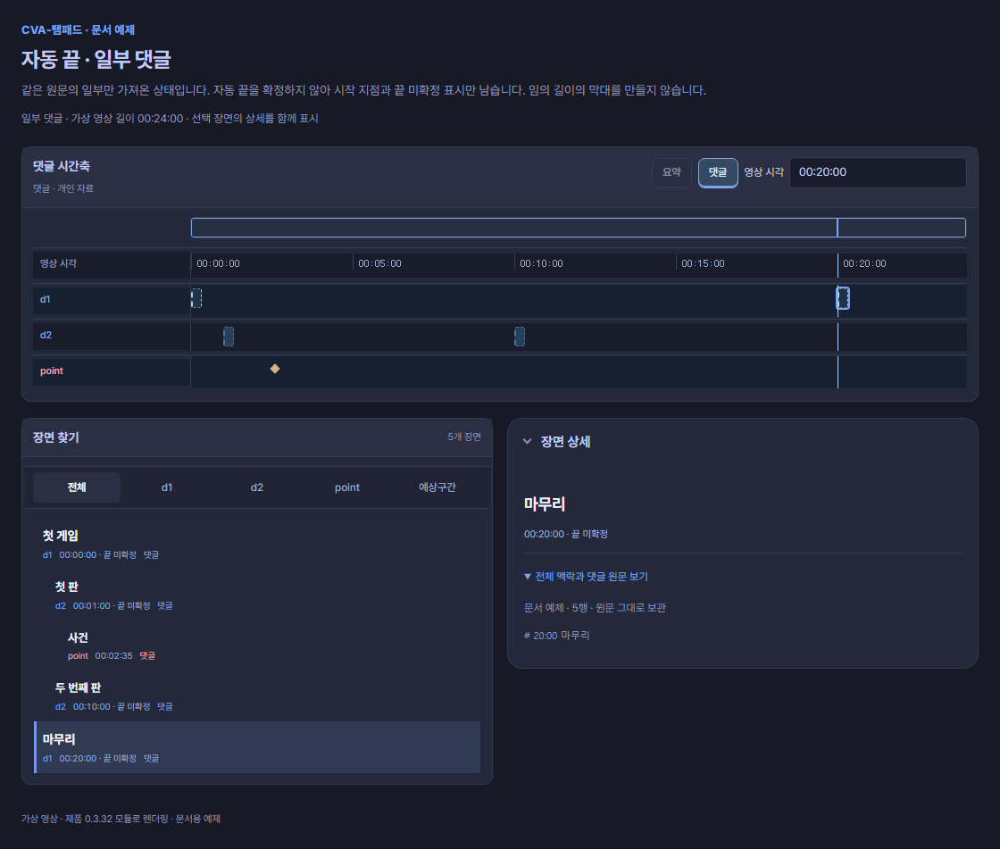

# 시간축 용어

CVA는 다시보기의 **큰 흐름 → 장면 → 다시 볼 순간 → 검토할 범위**를 구분합니다. 댓글을 가져오면 이 구분에 맞춰 시간축에 표시합니다. 같은 세로선은 현재 영상 시각이며, 각 행을 함께 읽는 기준입니다.

| 먼저 찾을 말 | 한 줄 뜻 |
| --- | --- |
| [D1 · D2 · Dn](#d1-d2-dn은-목차-깊이입니다) | 큰 흐름과 그 안의 장면을 나누는 목차 깊이 |
| [Point](#point는-여기서부터-보는-한-시점입니다) | 바로 이동해 볼 한 시점 |
| [예상 구간](#예상-구간은-컷으로-검토할-범위입니다) | 시작과 끝을 정해 컷으로 검토할 범위 |
| [자동 끝](#자동-끝과-예상-구간은-다릅니다) | 시작만 적은 이야기 구간의 끝을 확인 가능한 경계로 계산하는 규칙 |

자료를 준비하는 방법은 [요약과 JSON 가져오기](summary.md), 실제 표기법은 [구간과 강조](ranges.md)에서 이어서 확인하세요.

## D1 · D2 · Dn은 목차 깊이입니다

| 표시 | 뜻 | 예 |
| --- | --- | --- |
| **D1 맥락** | 방송의 큰 활동이나 이야기 흐름 | 한 게임 전체, 저챗, 노래 시간 |
| **D2 장면** | D1 안에서 따로 찾아볼 단계·판·장면 | 첫 판, 두 번째 판 |
| **Dn 상세 구간** | 더 깊이 나눈 하위 구간. n은 목차 깊이 | D3 라운드 → D4 세부 단계 |

숫자는 **중요도·재미 순위·영상 번호가 아닙니다**. 명시 제목은 `#`부터 `######`까지 D1–D6을 지원하며, 바로 위 단계 부모가 있어야 합니다. 현재 시간축의 D3–D6은 **D2 장면 행 안에서 깊이별로 아래에** 배치됩니다. 미리보기와 장면 목록에는 각 항목의 실제 Dn을 표시합니다.

CVA 요약의 기본 목차는 D1·D2입니다. D3–D6은 이 댓글·개인 자료에서 더 상세히 나눌 수 있는 깊이이며, 모든 요약이 여섯 단계로 작성된다는 뜻은 아닙니다.

```text
# 00:00 ~ 20:00 첫 게임
## 01:00 ~ 10:00 첫 판
### 02:00 ~ 05:00 첫 라운드
#### 02:10 ~ 04:00 공략 단계
##### 02:20 ~ 03:30 팀 플레이
###### 02:30 ~ 03:00 마지막 시도
- 02:35 결정적인 순간
```



**읽는 순서:** 큰 흐름인 D1에서 위치를 잡고, D2와 더 깊은 하위 구간으로 좁힙니다. Point는 이 구간들을 이해한 뒤 바로 찾아갈 한 시각입니다. 여러 깊이가 있어도 각각 다른 영상을 뜻하지 않습니다.

## Point는 여기서부터 보는 한 시점입니다

Point는 **여기서부터 보면 된다**는 이동 지점입니다. 길이가 없으며, 앞 맥락을 이해하기 위한 시작일 수도 있어 사건의 절정 시각과 반드시 같지는 않습니다. 마름모는 순간, 별은 작성자가 강조한 순간입니다. 별이 있다고 승인된 컷이나 높은 점수로 바뀌지는 않습니다.

Point 여러 개 사이를 자동으로 재생 범위로 채우지 않습니다. 시작·끝이 필요한 내용은 [구간과 강조](ranges.md#순간과-명시-범위)의 명시 범위를 사용하세요.

## 예상 구간은 컷으로 검토할 범위입니다

**예상 구간** 행은 컷으로 검토해 볼 시작·끝 범위를 보여줍니다. 현재 화면에서는 `[H]` 하이라이트와 `[H?]` 예상 후보가 이 행을 함께 사용합니다.

CVA에서 **Highlight**는 함께 봤을 때 내용을 이해하고 추출할 가치를 느낄 수 있는 선택 구간입니다. 관련된 순간과 필요한 앞뒤 맥락을 묶을 수 있으며, 길이나 Point 개수는 고정하지 않습니다. 떨어진 여러 원본 구간을 하나의 항목으로 담을 수도 있습니다. 다만 댓글의 `[H]`는 작성자가 제안한 범위이므로 실제 영상을 확인해 컷으로 선택하는 판단과 구별합니다.

| 표기·상태 | 해석 | 확인할 것 |
| --- | --- | --- |
| `[H]` | 작성자가 지정한 하이라이트 범위 | 댓글의 제안이며 관리자가 승인한 컷은 아님 |
| `[H?]`, `[예상]` | 검토 전 후보 범위 | **원문의 후보 표기**를 확인. 현재 시간축은 `[H]`와 같은 행·모양 사용 |
| 별·`BEST` | 작성자가 강조한 항목 | 강조는 구간 역할·승인과 별개 |
| 담은 컷 | 사용자가 컷 작업에 직접 담은 결과 | 시작·끝·출처를 별도로 확인 |



**같은 행에 있어도 의미는 다릅니다.** 위 예제의 04:10–04:30은 `[H]`, 05:00–05:20은 `[H?]`입니다. 현재 행의 색이나 위치만으로 둘을 구별할 수 없으므로, 선택한 항목의 **전체 맥락과 댓글 원문 보기**에서 `[H?]`를 확인하세요. 구간 막대의 제목이 좁아서 안 보이면 장면 목록과 상세를 함께 읽습니다.

## 자동 끝과 예상 구간은 다릅니다

자동 끝은 **시작만 적은 이야기 구간의 끝을 계산하는 규칙**입니다. 뒤의 같은 단계·상위 제목, 부모 끝, 확인된 영상 끝을 사용합니다. 자동으로 끝을 계산해도 D1/D2가 예상 하이라이트로 바뀌지는 않습니다.

```text
# 00:00 첫 게임
## 01:00 첫 판
- 02:35 사건
## 10:00 두 번째 판
# 20:00 마무리
```



위는 **전체 본문·영상 길이 24분이 확인된 가상 예제**입니다. 첫 게임은 다음 D1인 20:00까지, 첫 판은 다음 D2인 10:00까지, 두 번째 판은 부모의 20:00까지입니다. 마지막 마무리는 확인된 영상 끝 24:00까지입니다. 02:35 사건은 그대로 Point입니다.



부분 본문이면 생략된 경계를 알 수 없습니다. 위는 같은 입력을 **일부만 가져옴**으로 해석한 결과입니다. 끝 미확정 항목에는 닫힌 구간처럼 막대를 채우지 않습니다. 알 수 없는 영상 길이·누락된 경계에서도 끝이 미확정일 수 있으며, 이미 적은 끝은 자동 계산으로 덮어쓰지 않습니다.

## 다른 행도 함께 읽으세요

| 행 | 읽는 방법 |
| --- | --- |
| **사용자 메모** | 설명이나 참고 범위. 하이라이트·승인된 컷과 구별 |
| **편집 후보** | 편집 검토를 돕는 별도 후보 자료. 채택·승인은 별도 |
| **먼저 볼 구간** | 먼저 확인해 볼 탐색 단서 |
| **채팅량** | 불러온 채팅의 시간별 양. 재미·편집 승인 점수가 아님 |
| **시청자 클립** | 원본과 연결된 클립 위치. 시각 미확정 자료는 별도 확인 |
| **영상별 시각 행** | 원본·비교 영상의 길이와 현재 시점. 실제 같은 장면인지는 시각 맞추기로 확인 |

이 행들은 해당 자료를 불러왔을 때 나타납니다. `w.` 같은 인물 단서는 [참가자 후보](people.md#관련-인물-단서)이며, 확인된 영상 연결이나 전체 구간 참여를 자동으로 뜻하지 않습니다.

## 화면을 크게 보려면

예제 이미지를 선택하면 원본 크기로 볼 수 있습니다. [전체 편집 화면 보기](index.md#시간축에서는-이렇게-보입니다)
